Если в процессе установки будет выскакивать такое окно, не обращаем внимания, жмем "ОК" (придется нажать
        несколько раз подряд)  
        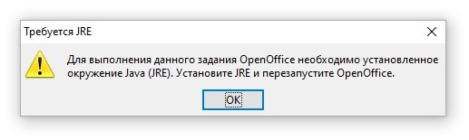
* Скопировать папку AtomtexLibrary в папку C:\Users\\<Имя
            пользователя>\AppData\Roaming\OpenOffice\4\user\basic  
        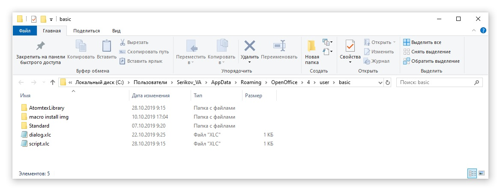
* Запустить OpenOffice Writer и в открывшемся документе нажать Alt+F11. В появившемся окне нажать "Управление"  
        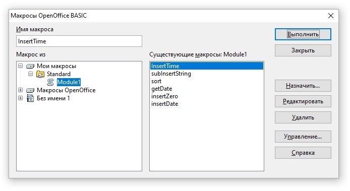
* Выбрать вкладку "Библиотеки" и нажать "Добавить"  
        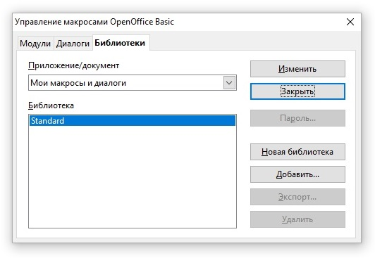
* Открыть папку, в которую распаковывали архив, и в папке "AtomtexLibrary" выбрать файл "script.xlb". Нажать
            "Открыть"  
        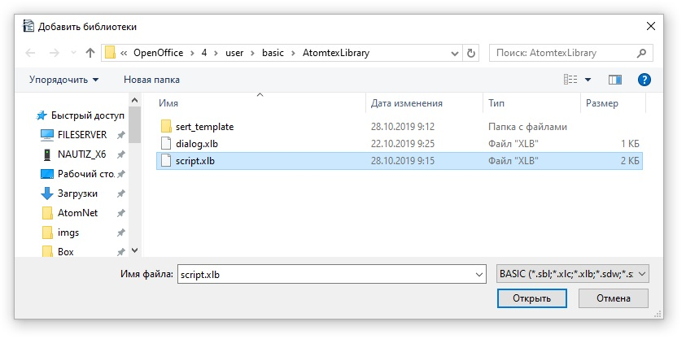
* Нажать "OK"  
        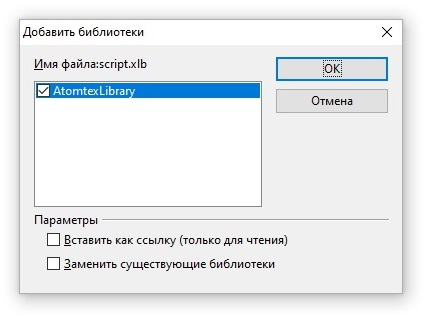
* Нажать "Закрыть"  
        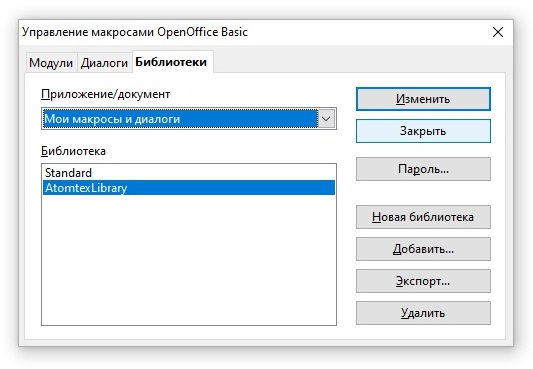
* Следующее окно не закрываем, раз уж мы здесь, сделаем ярлык для запуска макроса. Для этого выбираем нашу
            библиотеку
            ("AtomtexLibrary") и раскрываем её (нажимаем маленький плюсик):  
        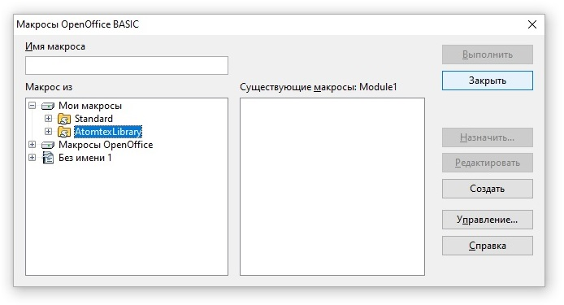
* Выбираем модуль "ModuleMain", а в нем &mdash; функцию "MainDialog_Show" (эта функция запускает главное окно
            макроса) и нажимаем "Назначить"  
        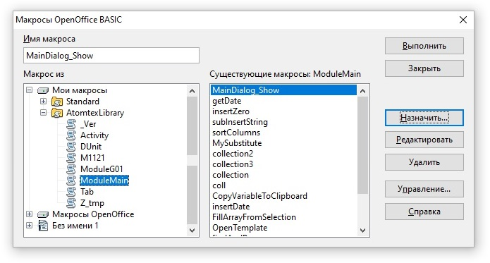
* Под ярлык макроса сделаем отдельную панель, так будет удобнее. Нажимаем "Создать"  
        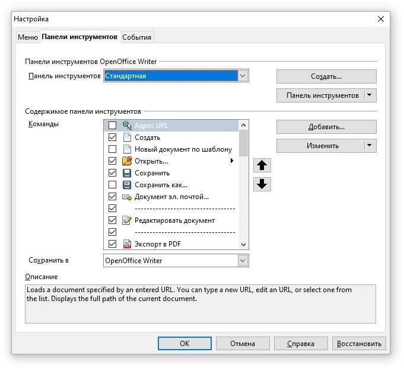
* Как-нибудь называем (например "Атомтех") и жмем "ОК"  
        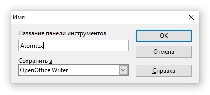
* Жмеем "Добавить"  
        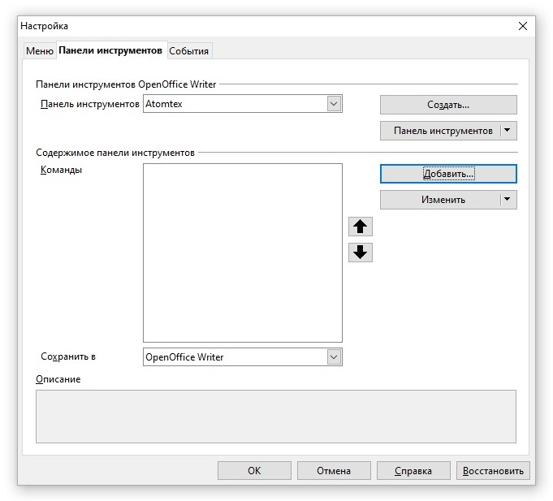
* Опять выбираем модуль "ModuleMain" и функцию "MainDialog_Show". Жмем "Добавить"  
        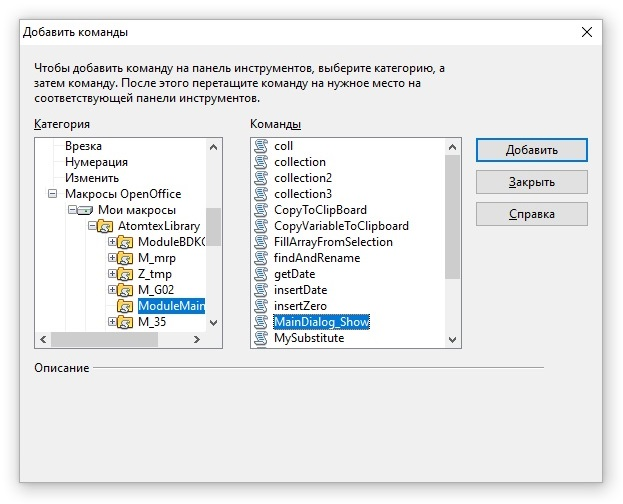
* Нажать "Изменить", "Добавить значек"  
        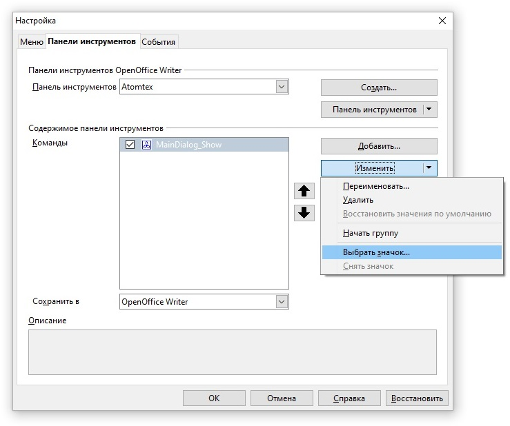
* Выбираем значек (если нужен значек АТОМТЕХ, жмем добавить и идем в папку с библиотекой, там где-то есть),
            жмем "ОК"  
        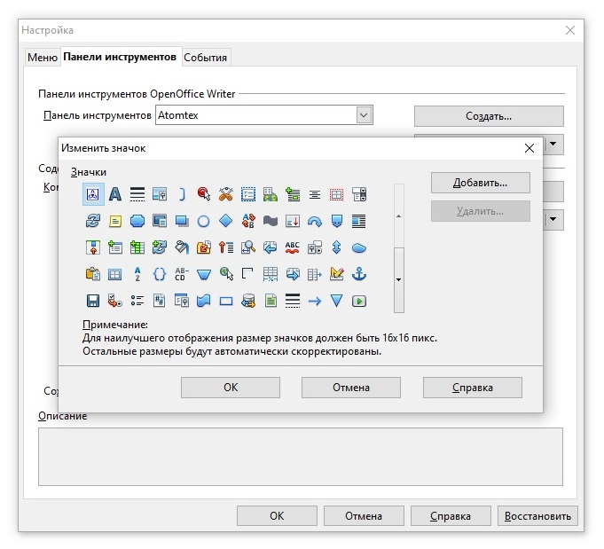
* Ща настроим пользователя. На окне программы OpenOffice Writer жмем Alt+F11. Выбираем модуль "ModuleMain",
            а в нем &mdash; функцию "MainDialog_Show" (уже такое было) и нажимаем "Редактировать"  
        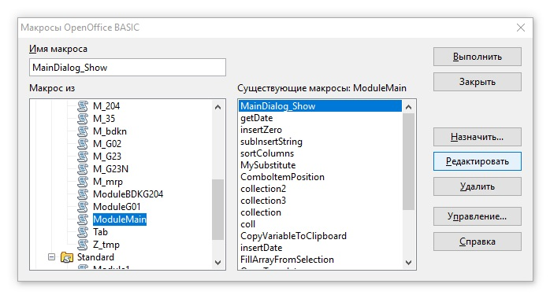
* Видим окно кода макроса, почти в самом верху видим строчку, как на картинке и меняем имя пользователя на
            своё. Жмякаем "Сохранить"  
        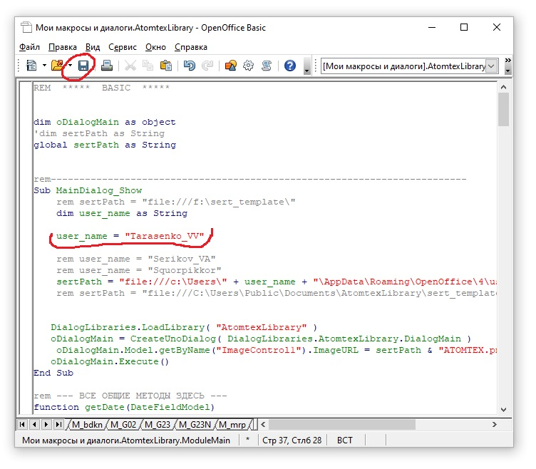
* Готово! Макрос установлен и работает  
        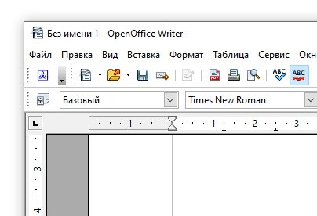

