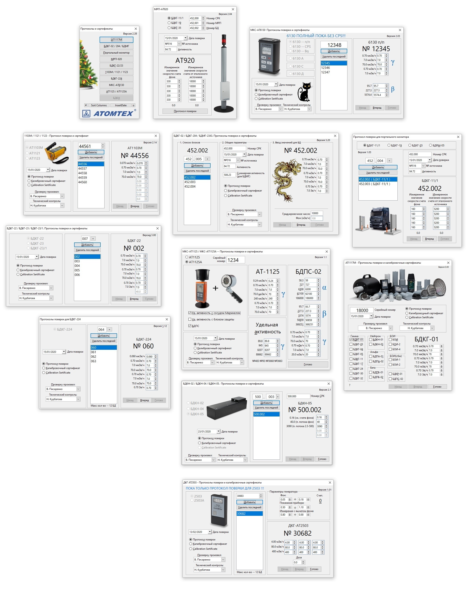

# AtomtexLibrary
Автоматизация протоколов поверки и калибровочных сертификатов

## Список поддерживаемых устройств:

* В составе 1117М — протокол поверки, протокол проверки, сертификат: БДКГ-01, БДКГ-03, БДКГ-04, БДКГ-05, БДКГ-11, БДКГ-17, БДКГ-24, БДКГ-30, БДКГ-32, БДКН-01, БДКН-03, БДПА-01, БДПА-02, БДПБ-01, БДПБ-02, БОИ, БОИ-2, БОИ-4, БОИ-1 (с СБМ), БОИ-2 (с СБМ), БДКР-01, БДПС-02
* БДКГ-02 (протокол поверки, протокол проверки, сертификат) 
* БДКГ-204 (протокол поверки, протокол проверки, сертификат)
* БДМГ-2343 (только протокол поверки)
* Портальный монитор — -11/1, -19, -35, БДРМ-05 (только протокол поверки)
* МРП-АТ920, 920В, 920Р — -11/1, -19, -35 (только протокол поверки)
* БДКГ-22, БДКГ-23, БДКГ-23/1 (протокол поверки, протокол проверки, сертификат)
* АТ1103М, АТ1121, АТ1123 (протокол поверки, протокол проверки, сертификат)
* АТ1125 — комплектация: только БД, БД+БДПС, БД+блок защиты, БД+блок защиты+БДПС
* АТ6130, АТ6130А, АТ6130С, АТ6130Д (протокол поверки, протокол проверки, сертификат)
* БДКН-02, БДКН-04, БДКН-05 (протокол поверки, протокол проверки, сертификат)
* БДКГ-11/1 для СРК (протокол поверки, протокол проверки, сертификат)

[Установка макроса](./INSTALL.md)  
[Список версий](./VERSION.md)

