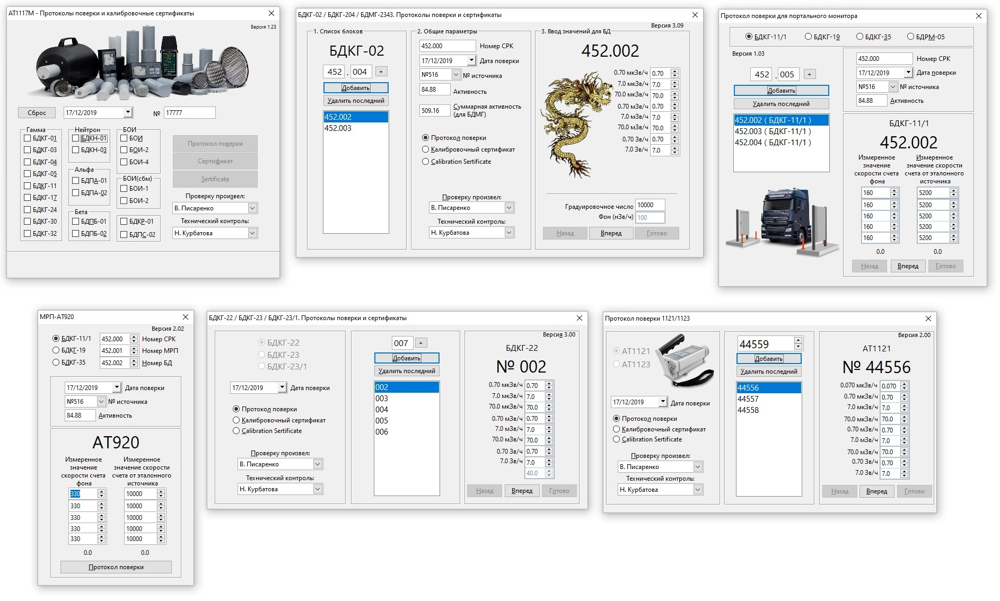
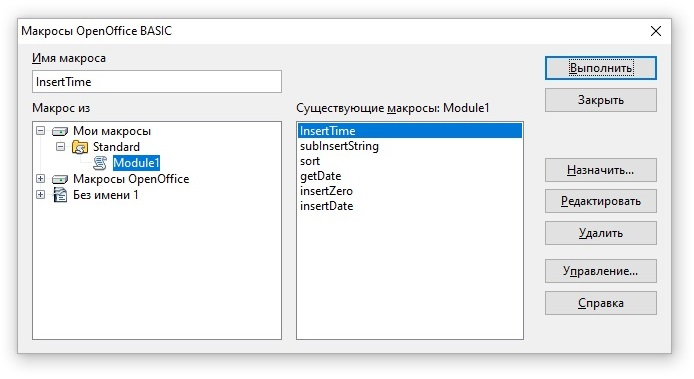
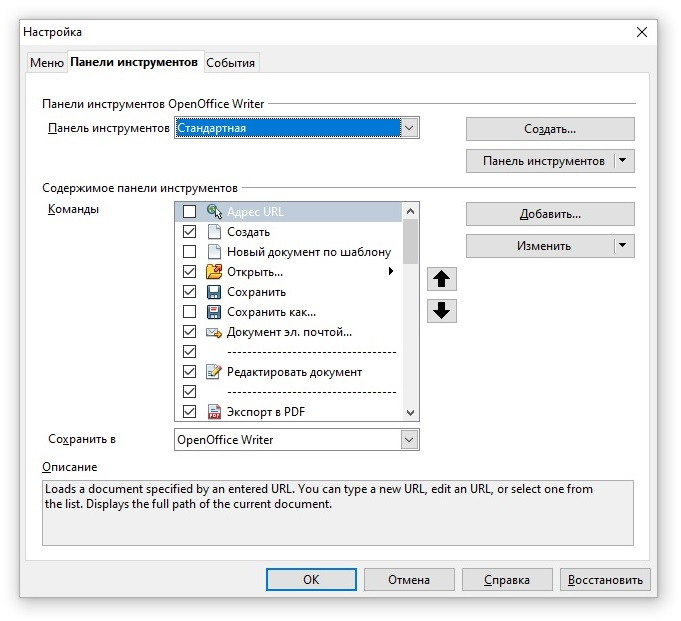
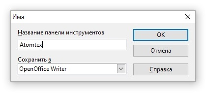
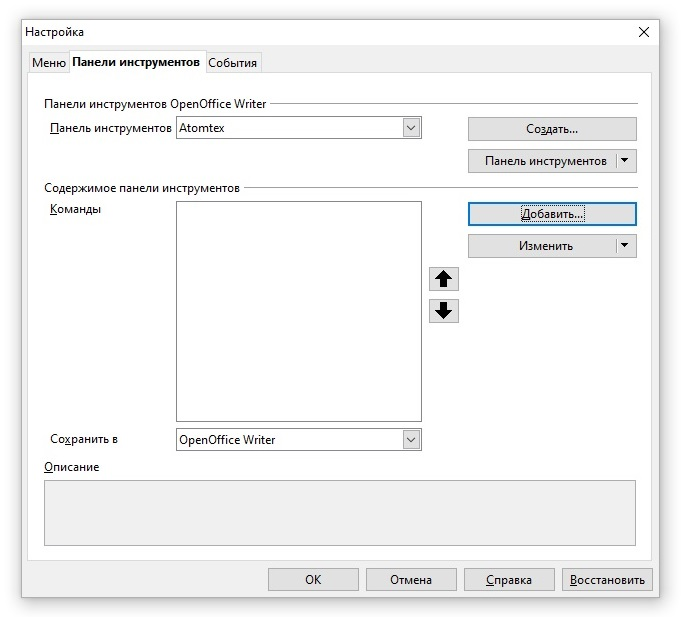
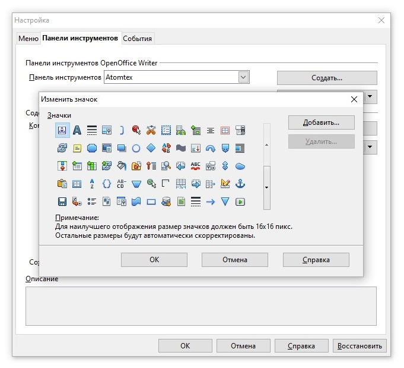
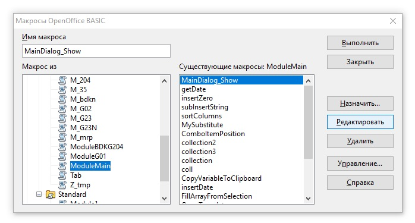
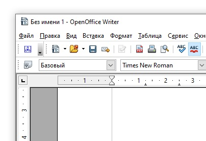

# AtomtexLibrary
Автоматизация протоколов поверки и калибровочных сертификатов

##Список поддерживаемых устройств:

* В составе 1117М — протокол поверки, протокол проверки, сертификат: БДКГ-01, БДКГ-03, БДКГ-04, БДКГ-05, БДКГ-11, БДКГ-17, БДКГ-24, БДКГ-30, БДКГ-32, БДКН-01, БДКН-03, БДПА-01, БДПА-02, БДПБ-01, БДПБ-02, БОИ, БОИ-2, БОИ-4, БОИ-1 (с СБМ), БОИ-2 (с СБМ), БДКР-01, БДПС-02
* БДКГ-02 (протокол поверки, протокол проверки, сертификат) 
* БДКГ-204 (протокол поверки, протокол проверки, сертификат)
* БДМГ-2343 (только протокол поверки)
* Портальный монитор — -11/1, -19, -35, БДРМ-05 (только протокол поверки)
* МРП-АТ920, 920В, 920Р — -11/1, -19, -35 (только протокол поверки)
* БДКГ-22, БДКГ-23, БДКГ-23/1 (протокол поверки, протокол проверки, сертификат)
* АТ1103М, АТ1121, АТ1123 (протокол поверки, протокол проверки, сертификат)
* АТ1125 — комплектация: только БД, БД+БДПС, БД+блок защиты, БД+блок защиты+БДПС
* АТ6130, АТ6130А, АТ6130С, АТ6130Д (протокол поверки, протокол проверки, сертификат)

##Установка:
[I'm a relative reference to a repository file](html/macro.html)

Если в процессе установки будет выскакивать такое окно, не обращаем внимания, жмем "ОК" (придется нажать
        несколько раз подряд)
        
* Скопировать папку AtomtexLibrary в папку C:\Users\\<Имя
            пользователя>\AppData\Roaming\OpenOffice\4\user\basic
        
* Запустить OpenOffice Writer и в открывшемся документе нажать Alt+F11. В появившемся окне нажать "Управление"
        
* Выбрать вкладку "Библиотеки" и нажать "Добавить"
        
* Открыть папку, в которую распаковывали архив, и в папке "AtomtexLibrary" выбрать файл "script.xlb". Нажать
            "Открыть"
        
* Нажать "OK"
        
* Нажать "Закрыть"
        
* Следующее окно не закрываем, раз уж мы здесь, сделаем ярлык для запуска макроса. Для этого выбираем нашу
            библиотеку
            ("AtomtexLibrary") и раскрываем её (нажимаем маленький плюсик):
        
* Выбираем модуль "ModuleMain", а в нем &mdash; функцию "MainDialog_Show" (эта функция запускает главное окно
            макроса) и нажимаем "Назначить"
        
* Под ярлык макроса сделаем отдельную панель, так будет удобнее. Нажимаем "Создать"
        
* Как-нибудь называем (например "Атомтех") и жмем "ОК"
        
* Жмеем "Добавить"
        
* Опять выбираем модуль "ModuleMain" и функцию "MainDialog_Show". Жмем "Добавить"
        
* Нажать "Изменить", "Добавить значек"
        
* Выбираем значек (если нужен значек АТОМТЕХ, жмем добавить и идем в папку с библиотекой, там где-то есть),
            жмем "ОК"
        
* Ща настроим пользователя. На окне программы OpenOffice Writer жмем Alt+F11. Выбираем модуль "ModuleMain",
            а в нем &mdash; функцию "MainDialog_Show" (уже такое было) и нажимаем "Редактировать"
        
* Видим окно кода макроса, почти в самом верху видим строчку, как на картинке и меняем имя пользователя на
            своё. Жмякаем "Сохранить"
        
* Готово! Макрос установлен и работает
        

